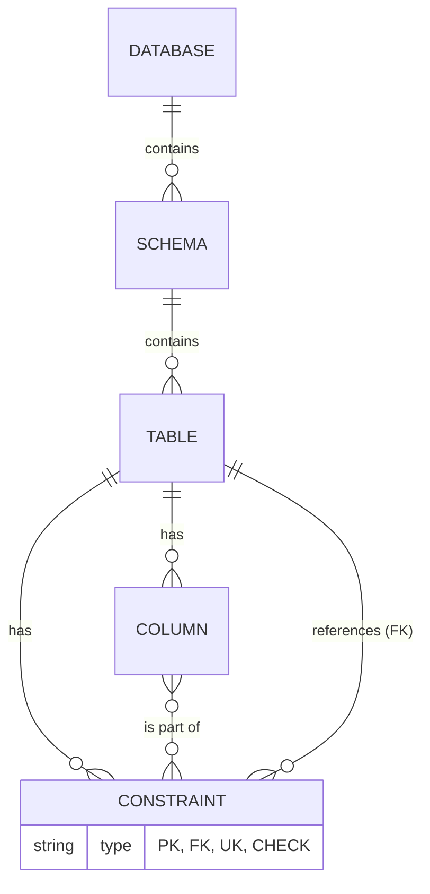

Com certeza! Adaptar os scripts e conceitos para o SGBD **IBM Informix** requer o uso da sua sintaxe específica para triggers (SPL - Stored Procedure Language) e a consulta ao seu catálogo de sistema (`systables`, `sysconstraints`, etc.) em vez do `information_schema`.

Abaixo estão todas as questões resolvidas com a sintaxe correta para o Informix.

---

### **1 - TRIGGERS**

No Informix, os triggers são criados com uma sintaxe um pouco diferente, geralmente definindo a lógica diretamente no corpo do trigger, sem a necessidade de uma função separada.

#### **1.1 - Ajuste da quantidade de moradores de bairros**

Criaremos três triggers separados, um para cada evento (`INSERT`, `DELETE`, `UPDATE`), para manter a clareza e a eficiência.

**Trigger para INSERT**
Quando um novo cliente é cadastrado, incrementa a contagem de pessoas no bairro correspondente.

```sql
-- Trigger para INSERT na tabela cliente
CREATE TRIGGER trg_cliente_after_insert
    INSERT ON cliente
    REFERENCING NEW AS n
    FOR EACH ROW (
        UPDATE bairro
        SET baiqtdepessoas = baiqtdepessoas + 1
        WHERE baicodigo = n.clibaicodigo
    );
```

**Trigger para DELETE**
Quando um cliente é removido, decrementa a contagem de pessoas do seu bairro.

```sql
-- Trigger para DELETE na tabela cliente
CREATE TRIGGER trg_cliente_after_delete
    DELETE ON cliente
    REFERENCING OLD AS o
    FOR EACH ROW (
        UPDATE bairro
        SET baiqtdepessoas = baiqtdepessoas - 1
        WHERE baicodigo = o.clibaicodigo
    );
```

**Trigger para UPDATE**
Quando o bairro de um cliente é alterado (`clibaicodigo`), decrementa a contagem do bairro antigo e incrementa a do novo.

```sql
-- Trigger para UPDATE na tabela cliente
CREATE TRIGGER trg_cliente_after_update
    UPDATE OF clibaicodigo ON cliente
    REFERENCING NEW AS n OLD AS o
    FOR EACH ROW
    WHEN (n.clibaicodigo <> o.clibaicodigo) -- Otimização para rodar só quando o bairro muda
    (
        -- Decrementa a contagem do bairro antigo
        UPDATE bairro
        SET baiqtdepessoas = baiqtdepessoas - 1
        WHERE baicodigo = o.clibaicodigo;

        -- Incrementa a contagem do bairro novo
        UPDATE bairro
        SET baiqtdepessoas = baiqtdepessoas + 1
        WHERE baicodigo = n.clibaicodigo
    );
```

---

#### **1.2 - Trigger para atualizar o saldo do produto**

Este trigger será acionado após a inserção de um novo registro em `itemvenda` para subtrair a quantidade vendida do saldo do produto.

```sql
-- Trigger para INSERT na tabela itemvenda
CREATE TRIGGER trg_itemvenda_after_insert
    INSERT ON itemvenda
    REFERENCING NEW AS n
    FOR EACH ROW (
        UPDATE produto
        SET prosaldo = prosaldo - n.itvqtde
        WHERE procodigo = n.itvprocodigo
    );

-- Observação: Para evitar a venda de um produto com saldo insuficiente,
-- o ideal seria um trigger "BEFORE INSERT" que pudesse cancelar a operação.
-- Em Informix, isso seria feito com a instrução RAISE EXCEPTION. Ex:
-- CREATE TRIGGER trg_valida_saldo BEFORE INSERT ON itemvenda...
-- ( IF (SELECT prosaldo FROM produto WHERE procodigo = n.itvprocodigo) < n.itvqtde THEN
--      RAISE EXCEPTION -746, 0, 'Saldo de produto insuficiente para a venda.';
--   END IF;
-- ... )
```

---

### **2 - CATÁLOGO**

#### **2.1 - Diagrama de Relacionamentos do Catálogo**

O diagrama conceitual permanece o mesmo, pois ele representa a lógica de metadados, que é universal entre SGBDs. A implementação interna muda, mas a relação lógica não.


**Explicação:** A explicação do diagrama continua a mesma. O que muda é como consultamos essas estruturas no Informix.

---

#### **2.2 - Stored Procedure para Listar Relacionamentos**

Para criar uma Stored Procedure no Informix que consulta o catálogo do sistema, usamos as tabelas `systables`, `sysconstraints`, e `sysreferences`. Esta procedure retornará um conjunto de linhas.

```sql
-- Stored Procedure em Informix (SPL)
CREATE PROCEDURE sp_listar_relacionamentos(p_table_name VARCHAR(128))
RETURNING VARCHAR(128), VARCHAR(255); -- Coluna 1: Tabela relacionada, Coluna 2: Descrição

    DEFINE v_rel_table VARCHAR(128);
    DEFINE v_rel_desc VARCHAR(255);

    -- Lógica para encontrar tabelas que referenciam a tabela informada (Lado 1 -> N)
    -- Aqui, p_table_name é o lado '1' do relacionamento.
    FOREACH
        SELECT t_fk.tabname INTO v_rel_table
        FROM
            systables AS t_pk,
            sysconstraints AS c_pk,
            sysreferences AS r,
            sysconstraints AS c_fk,
            systables AS t_fk
        WHERE t_pk.tabname = p_table_name
          AND t_pk.tabid = c_pk.tabid AND c_pk.constrtype = 'P'
          AND c_pk.constrid = r.primaryid
          AND r.constrid = c_fk.constrid
          AND c_fk.tabid = t_fk.tabid

        LET v_rel_desc = 'É o lado 1 de um relacionamento 1-N com a tabela ' || v_rel_table;
        RETURN v_rel_table, v_rel_desc WITH RESUME;

    END FOREACH;

    -- Lógica para encontrar tabelas que a tabela informada referencia (Lado N -> 1)
    -- Aqui, p_table_name é o lado 'N' do relacionamento.
    FOREACH
        SELECT t_pk.tabname INTO v_rel_table
        FROM
            systables AS t_fk,
            sysconstraints AS c_fk,
            sysreferences AS r,
            sysconstraints AS c_pk,
            systables AS t_pk
        WHERE t_fk.tabname = p_table_name
          AND t_fk.tabid = c_fk.tabid AND c_fk.constrtype = 'R'
          AND c_fk.constrid = r.constrid
          AND r.primaryid = c_pk.constrid
          AND c_pk.tabid = t_pk.tabid

        LET v_rel_desc = 'É o lado N de um relacionamento N-1 com a tabela ' || v_rel_table;
        RETURN v_rel_table, v_rel_desc WITH RESUME;

    END FOREACH;

END PROCEDURE;
```

**Como usar a Stored Procedure no Informix:**

A chamada é feita com o comando `EXECUTE PROCEDURE`.

```sql
-- Exemplo de uso para a tabela 'bairro'
EXECUTE PROCEDURE sp_listar_relacionamentos('bairro');
```

**Resultado esperado para a tabela `bairro`:**

| (expression) | (expression)                                                |
|--------------|-------------------------------------------------------------|
| cliente      | É o lado 1 de um relacionamento 1-N com a tabela cliente    |
| funcionario  | É o lado 1 de um relacionamento 1-N com a tabela funcionario|
| filial       | É o lado 1 de um relacionamento 1-N com a tabela filial     |
| zona         | É o lado N de um relacionamento N-1 com a tabela zona       |


---

### **3 - TRANSAÇÕES**

#### **3.1 - Como realizar uma transação e comandos suportados no Informix**

O conceito de transação é o mesmo, mas a sintaxe dos comandos tem uma nomenclatura tradicional no Informix. Para que as transações funcionem, o banco de dados **deve ter sido criado com logging** (ex: `CREATE DATABASE meu_banco WITH LOG;`).

**Como realizar uma transação:**

O fluxo é idêntico: iniciar, executar comandos e, ao final, confirmar ou desfazer.

**Comandos Suportados no Informix:**

1.  **`BEGIN WORK`** (equivalente a `START TRANSACTION`):
    *   **Função**: Marca o início de um bloco de transação. É o comando mais comum no Informix para esta finalidade.

2.  **`COMMIT WORK`** (equivalente a `COMMIT`):
    *   **Função**: Confirma a transação, tornando todas as alterações permanentes e visíveis para outras sessões.

3.  **`ROLLBACK WORK`** (equivalente a `ROLLBACK`):
    *   **Função**: Desfaz todas as alterações feitas desde o `BEGIN WORK`, restaurando o estado anterior do banco de dados.

4.  **`SAVEPOINT nome_do_ponto`**:
    *   **Função**: Cria um ponto de salvamento dentro de uma transação.
    *   **`ROLLBACK TO SAVEPOINT nome_do_ponto`**: Permite desfazer as operações até um `SAVEPOINT` específico sem reverter a transação inteira. Este comando é idêntico ao padrão SQL.

**Exemplo Prático (Sintaxe Informix): Transferência de saldo entre dois produtos**

```sql
-- Inicia a transação
BEGIN WORK;

-- Tentativa de executar as operações
-- 1. Tira 5 unidades do saldo do produto 1
UPDATE produto
SET prosaldo = prosaldo - 5
WHERE procodigo = 1;

-- 2. Adiciona 5 unidades ao saldo do produto 2
UPDATE produto
SET prosaldo = prosaldo + 5
WHERE procodigo = 2;

-- Se tudo ocorreu como esperado, confirma a transação:
COMMIT WORK;

-- Se algo deu errado (ex: um erro foi encontrado),
-- poderíamos desfazer tudo:
-- ROLLBACK WORK;
```