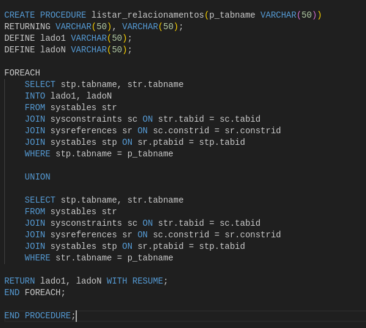
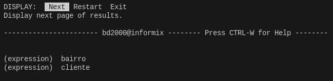

# Criação de triggers, utilização do catálogo e comandos para controle de transações.

### Matheus Víctor  
### Alysson Gabriel  
### Rian Rodrigues  
### João Pedro
 

---

# 1. Triggers

## **1.1 Ajuste da quantidade de moradores de bairros, a partir da atualização do bairro de clientes**

---
   

## **1.2 Trigger para atualizar a quantidade de saldo do produto, ao realizar uma venda deste produto**

---

# 2. Catálogo

## **2.1 Diagramas**

---
   

## **2.2 Procedure - relacionamento entre tabelas**

### **2.2.1 Procedure MariaDB**

---

### **2.2.2 Procedure Informix**

---

## **2.3 Procedure - Resultados**

### **2.3.1 Procedure MariaDB**

---

### **2.3.2 Procedure Informix**

---

# 3. Transações

## **3.1 Trasações no informix**

---
   